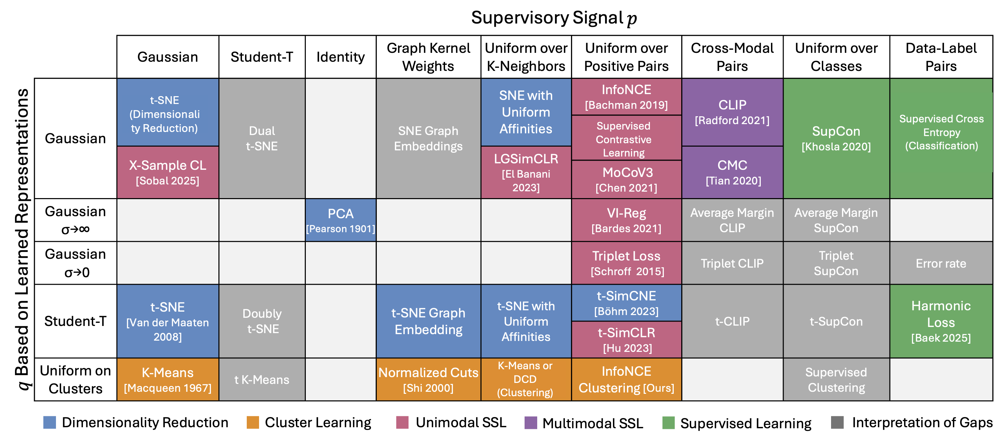

built some cool stuff w/ MIT people

<div align="center">

# I-Con: A Unifying Framework for Representation Learning

[](https://iclr.cc/)
[](https://aka.ms/i-con)
[](https://arxiv.org/pdf/2504.16929)
[](https://youtu.be/UvjTbnFzRac)
[](https://news.mit.edu/2025/machine-learning-periodic-table-could-fuel-ai-discovery-0423)

<br>

**[Shaden Alshammari](http://shadealsha.github.io)** • **[John R. Hershey](https://research.google/people/john-hershey/)** • **[Axel Feldmann](https://feldmann.nyc/)** • **[William T. Freeman](https://billf.mit.edu/about/bio)** • **[Mark Hamilton](https://mhamilton.net/)**

<br>



<br>

> **TL;DR**: We introduce a single equation that unifies >20 machine learning methods into a periodic table. Our framework enables rapid prototyping of new ML algorithms with just a few lines of code.

</div>

## 🚀 Quick Start
Implement SimCLR in 5 lines:

```python
from model import Model
from config import Config
from mappers import SimpleCNN
from distributions import Augmentation, Gaussian

config = Config(
    mapper=SimpleCNN(output_dim=128, input_key="image", output_key="embedding"),
    supervisory_distribution=Augmentation(input_key="index"),
    learned_distribution=Gaussian(sigma=0.5, metric="cosine", input_key="embedding"),
    lr=1e-3
)

model = Model(config)
```

## Core Concept

Every representation learning method answers three questions:

| Component | Purpose | Examples |
|-----------|---------|----------|
| **Mapper** | How to encode inputs? | CNN, ResNet, LookupTable |
| **Supervisory Distribution** | What relationships exist in input space? | Labels, Augmentations, k-NN, Gaussian |
| **Learned Distribution** | How to model embedding relationships? | Gaussian, Student-t, UniformCluster |

```python
config = Config(
    mapper=...,                    # Neural architecture 
    supervisory_distribution=...,  # Input space relationships
    learned_distribution=...,      # Embedding space relationships
)
```

## Examples


**Parametric t-SNE**
```python
Config(
    mapper=SimpleCNN(output_dim=2),
    supervisory_distribution=Gaussian(sigma=5, input_key="image"),
    learned_distribution=StudentT(gamma=1, input_key="embedding")
)
```

**Supervised Contrastive Learning**
```python
Config(
    mapper=SimpleCNN(output_dim=128, unit_sphere=True),
    supervisory_distribution=Label(input_key="label"),
    learned_distribution=Gaussian(sigma=0.4)
)
```

**Cross-Entropy with Learnable Classes**
```python
Config(
    mapper=[SimpleCNN(output_dim=128), LookUpTable(num_embeddings=10)],
    supervisory_distribution=Label(num_classes=10),
    learned_distribution=Gaussian(sigma=0.5, metric="dot")
)
```

## Features

**Built-in Components**: Distance-based kernels (Gaussian, StudentT), graph methods (UniformKNN, Label), clustering approaches, and neural architectures (SimpleCNN, ResNet, MLPMapper, LookUpTable). All components are easily extensible.

**Visualization Suite**: Automatic embedding plots, neighborhood distributions, cluster analysis, and probability visualizations with TensorBoard integration.

**Training Example**:
```python
from visualization import PlotLogger, EmbeddingsPlot

plot_logger = PlotLogger([EmbeddingsPlot(), NeighborhoodDistPlot()])
trainer = pl.Trainer(callbacks=[plot_logger])
trainer.fit(model, train_loader, test_loader)
```

View results: `tensorboard --logdir=notebook_logs`

## Installation

```bash
git clone https://github.com/ShadeAlsha/ICon.git
cd ICon
pip install -r requirements.txt
```

**Requirements**: PyTorch, PyTorch Lightning, matplotlib, plotly

## Why This Matters

| Before | After |
|--------|-------|
| Separate implementations for each method | Universal config pattern |
| `implement_tsne()`, `implement_simclr()` | `Config(mapper=..., supervisory=..., learned=...)` |

Switch methods by changing components:
```python
# SimCLR → tSimCLR
learned_distribution=Gaussian(...)        # SimCLR
supervisory_distribution=StudentT(...)    # t-SimCLR
```

## Resources

- [Complete Notebook](Visualization.ipynb) - Many methods with visualizations

## Citation

```bibtex
@inproceedings{alshammariunifying,
  title={I-Con: A Unifying Framework for Representation Learning},
  author={Alshammari, Shaden Naif and Hershey, John R and Feldmann, Axel and Freeman, William T and Hamilton, Mark},
  booktitle={The Thirteenth International Conference on Learning Representations},
  year={2025}
}
```

## Contact

Questions? Contact [Shaden Alshammari](mailto:shaden@mit.edu)
